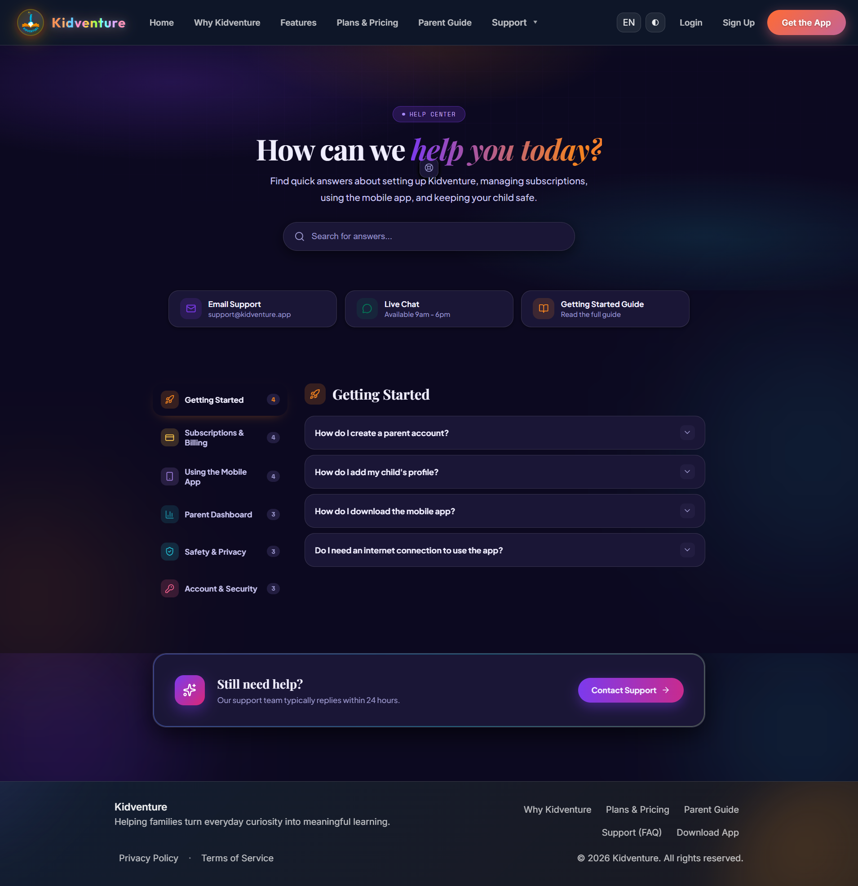

<div align="center">


<br />
<br />

<h1>🚀 Kidventure</h1>

<h3><em>Where Learning Becomes an Adventure</em></h3>

<p>
An AI-powered learning ecosystem that turns a child's screen time into<br/>
purposeful, curriculum-aligned adventures — and gives parents complete visibility along the way.
</p>

<p>
  
  
  
  
</p>

<p>
  <a href="https://kidventure-1913.vercel.app/"></a>
</p>

<p>
  <a href="#-the-problem">The Problem</a> ·
  <a href="#-the-solution">The Solution</a> ·
  <a href="#-live-demo">Live Demo</a> ·
  <a href="#-a-closer-look">A Closer Look</a> ·
  <a href="#-under-the-hood">Under the Hood</a> ·
  <a href="#-project-structure">Structure</a> ·
  <a href="#-getting-started">Getting Started</a> ·
  <a href="#-project-status">Status</a>
</p>

</div>

<br />

## 🎯 The Problem

Children today are growing up inside an attention economy engineered against them.

Infinite scroll, short-form video, and algorithmic feeds are built on a single mechanic: **zero effort, instant reward.** Traditional education can't compete with that — it asks for patience, focus, and structure, and next to a feed that never stops, it simply feels *slow*.

The measurable result is a generation with shrinking attention spans, a shrinking appetite for deep learning, and parents left staring at screen-time reports that say *how long*, but never *what for*.

<br />

## 💡 The Solution

**Kidventure doesn't fight screen time. It redirects it.**

Instead of adding another app to the pile of things competing for a child's attention, Kidventure rebuilds the *mechanics* children already love — progress, rewards, curiosity, story — and points them at real, curriculum-aligned learning. The result feels less like homework and more like the adventure it's named after.

The product is engineered as a two-platform ecosystem sharing one identity:

| Platform | Audience | Role |
|:---|:---|:---|
| 📱 **Mobile App** *(Flutter)* | Children, ages 6–9 | Gamified learning — interactive stories, quizzes, flashcards, mind maps, 3D models, an AI chatbot tutor, and a CNN-powered drawing-detection game |
| 💻 **Web Platform** *(this repository)* | Parents | The marketing experience parents discover Kidventure through, and the private dashboard they use to follow their child's learning journey |

This repository holds the **web platform** — a fully bilingual, dual-themed React application built to carry the entire brand experience, from the very first landing page to the parent's dashboard.

<br />

## 🔴 Live Demo

<div align="center">

### 👉 **[kidventure-1913.vercel.app](https://kidventure-1913.vercel.app/)** 👈

Switch between light and dark mode. Flip the language to Arabic and watch the *entire* interface mirror into RTL — not just the text. Create a real account through a live Supabase-powered sign-up flow. Then explore the Parent Dashboard.

</div>

<br />

## 🖼️ A Closer Look

<table>
<tr><td width="100%"></td></tr>
<tr><td align="center"><sub><b>Home — Light Mode</b></sub></td></tr>
</table>

<table>
<tr><td width="100%"></td></tr>
<tr><td align="center"><sub><b>Home — Dark Mode</b></sub></td></tr>
</table>

<table>
<tr><td width="100%"></td></tr>
<tr><td align="center"><sub><b>Arabic — full RTL mirroring, not just translated text</b></sub></td></tr>
</table>

<table>
<tr><td width="100%"></td></tr>
<tr><td align="center"><sub><b>"Why Kidventure" — a storybook-style scroll narrative</b></sub></td></tr>
</table>

<br />

**Authentication**, live and connected to Supabase:

<table>
<tr>
<td width="50%"></td>
<td width="50%"></td>
</tr>
<tr>
<td align="center"><sub>Sign In</sub></td>
<td align="center"><sub>Create Account</sub></td>
</tr>
</table>

**The Parent Dashboard**, the full UX vision previewed with sample data:

<table>
<tr>
<td width="50%"></td>
<td width="50%"></td>
</tr>
<tr>
<td align="center"><sub>Reports — progress by subject</sub></td>
<td align="center"><sub>Multi-child family profiles</sub></td>
</tr>
</table>

**Download & Support** — the pages that close the loop between marketing and product:

<table>
<tr>
<td width="50%"></td>
<td width="50%"></td>
</tr>
<tr>
<td align="center"><sub>Download the app</sub></td>
<td align="center"><sub>Support & Help Center</sub></td>
</tr>
</table>

<br />

## ✨ Features

**🌍 Bilingual by design, not by patch.** Localization here isn't a translated string table bolted onto an English layout — English and Arabic are first-class citizens. Switching languages flips the entire interface into a genuine RTL layout: navigation, card alignment, spacing, and iconography all mirror correctly, powered by `i18next` and `i18next-browser-languagedetector`.

**🌗 Light and dark, considered from the first pixel.** Every page — the seven-page marketing site and the parent dashboard alike — ships with two fully designed themes, switchable instantly with no layout shift and no flash of unstyled content.

**🔐 Authentication that actually works.** Sign up and login are connected to a live Supabase project. This isn't a static mock — create an account on the demo right now and the flow runs end to end.

**🎬 A marketing site built to tell a story, not just to list features.** Seven distinct pages — Home, Why Kidventure, Features, Plans & Pricing, Parent Guide, Support, and Contact — choreographed with `Framer Motion` so every transition and reveal earns its place instead of existing for decoration.

**📊 A dashboard designed around parental trust.** Learning streaks, subject-by-subject progress, badges, AI-generated insight cards, multi-child family management, and subscription controls — built to deliver on the promise the landing page makes.

<br />

## 🧩 Under the Hood

This is a single-page application, built and shipped as pure **React + Vite** — deliberately without a framework-level backend such as Laravel or Next.js API routes. Every piece of the stack earns its place:

- **React 19 + Vite 7** — the fastest possible developer feedback loop, paired with the newest React primitives for a UI this animation-heavy.
- **React Router v7** — client-side routing for the seven marketing pages, the auth flow, and the dashboard, all inside one seamless SPA.
- **Framer Motion** — every page transition, card reveal, and hover state is intentional motion design, not CSS afterthoughts.
- **i18next / react-i18next / i18next-browser-languagedetector** — the localization engine behind full English↔Arabic switching, including automatic language detection and complete RTL layout mirroring.
- **A custom CSS design system** — hand-built with PostCSS and Autoprefixer instead of a generic utility framework, so every themed page (light/dark × EN/AR) stays pixel-precise.
- **Supabase JS Client** — currently wired to power **authentication only** (sign up / login). It's the first integration point of a larger backend that will eventually connect this dashboard to live data from across the Kidventure ecosystem.

<br />

## 📁 Project Structure

```
kidventure/
├── docs/
│   └── screenshots/      README assets
├── public/
├── src/
│   ├── assets/            Images, icons, and static media
│   ├── components/        Reusable UI building blocks
│   ├── config/             App-level configuration (incl. Supabase client)
│   ├── i18n/                Translation files & i18next setup (en / ar)
│   ├── layout/             Shared layout shells (nav, footer, wrappers)
│   ├── lib/                  Utility functions & helpers
│   ├── pages/               Marketing pages & the Parent Dashboard
│   ├── routes/              React Router route definitions
│   ├── services/            Supabase auth calls & API-facing logic
│   ├── styles/               Global & shared CSS
│   ├── App.jsx
│   └── main.jsx
├── index.html
├── vite.config.js
└── package.json
```

<br />

## 🚀 Getting Started

### Prerequisites

- Node.js 18+
- npm

### Installation

```bash
git clone https://github.com/omniaalessawy247-hash/kidventure.git
cd kidventure
npm install
npm run dev
```

The app will be running at `http://localhost:5173`.

> Supabase credentials for authentication are configured directly inside `src/config`. If you're connecting your own Supabase project, update the client initialization there with your project URL and anon key.

### Other scripts

| Command | Description |
|:---|:---|
| `npm run build` | Build the app for production |
| `npm run preview` | Preview the production build locally |
| `npm run lint` | Run ESLint |

<br />

## 🗺️ Project Status

Kidventure's web platform is under active development as part of a graduation project. Here's exactly where things stand:

| Area | Status |
|:---|:---|
| 🌐 Marketing site — all 7 pages, EN/AR, light/dark | ✅ Complete |
| 🔐 Authentication (sign up & login) | ✅ Live, connected to Supabase |
| 📊 Parent Dashboard UI | ✅ Complete — currently displaying illustrative sample data |
| 🔌 Dashboard ↔ live data integration | 🚧 In progress |
| 🤖 AI-generated insights & reports | 🚧 In progress |

The dashboard shown in the screenshots above represents the intended final product — deliberately built ahead of the backend so the complete vision is clear before wiring it to live data from across the broader Kidventure ecosystem.

<br />

## 🤝 Contributing

This project is part of an academic graduation project, but contributions, issues, and feature suggestions are always welcome. Feel free to open an [issue](../../issues).

<br />

## 📄 License

Add your preferred license here (e.g. MIT).

<br />

<div align="center">

**Built with React, Vite & Supabase — part of the Kidventure ecosystem**

### [🔴 Try the Live Demo](https://kidventure-1913.vercel.app/)

</div>
