<div align="center">

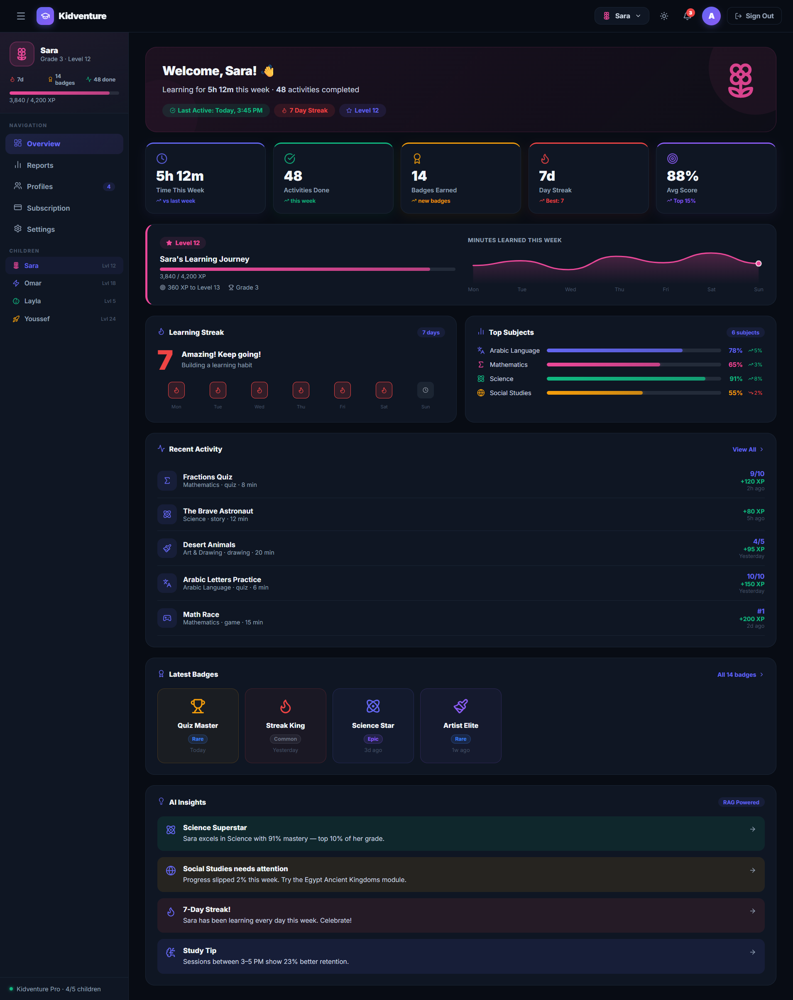

<br />
<br />

<h1>Kidventure</h1>

<p><b>AI-powered learning ecosystem for children — a bilingual, dual-theme parent web platform built to replace passive screen time with active, curriculum-aligned learning.</b></p>

<p>
  
  
  
  
</p>

<p>
  
  
  
  
</p>

<p>
  <a href="#-about-kidventure">About</a> ·
  <a href="#-screenshots">Screenshots</a> ·
  <a href="#-features">Features</a> ·
  <a href="#-tech-stack">Tech Stack</a> ·
  <a href="#-getting-started">Getting Started</a> ·
  <a href="#-project-status--roadmap">Status & Roadmap</a>
</p>

</div>

<br />

## 📖 About Kidventure

Children aged 6–9 are growing up conditioned by short-form content to expect instant gratification — and traditional learning tools can't compete with that stimulation. **Kidventure** is an AI-powered educational ecosystem built to solve this by turning screen time into an active adventure instead of passive scrolling.

The full ecosystem is made up of two applications sharing one backend:

<div align="center">

| Platform | Audience | Description |
|:---|:---|:---|
| 📱 **Mobile App** (Flutter) | Children | Gamified learning: interactive stories, quizzes, flashcards, mind maps, 3D models, an AI chatbot tutor, and a CNN-powered drawing-detection game |
| 💻 **Web Platform** (this repo) | Parents | Marketing site + Parent Dashboard to monitor a child's learning progress, manage subscriptions, and review AI-generated insights |

</div>

This repository contains the **web platform**: the public marketing site and the parent-facing dashboard, built with React and Supabase.

<br />

## 📸 Screenshots

**Marketing site — light & dark, English & Arabic (RTL)**

<table>
<tr>
<td width="50%">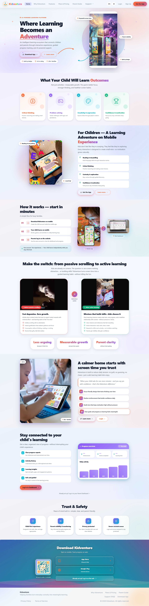</td>
<td width="50%">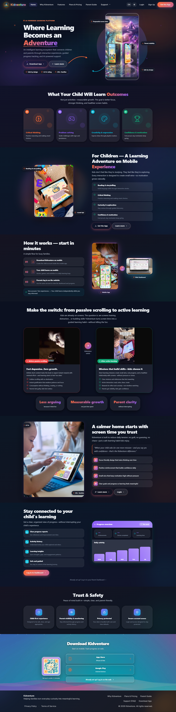</td>
</tr>
<tr>
<td align="center"><sub>Home — Light mode</sub></td>
<td align="center"><sub>Home — Dark mode</sub></td>
</tr>
</table>

<table>
<tr>
<td width="50%">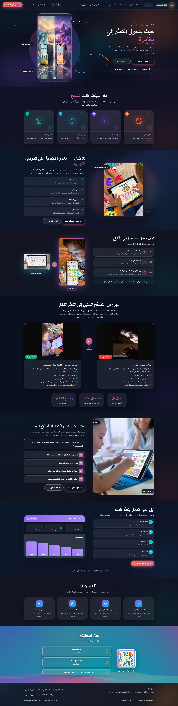</td>
<td width="50%">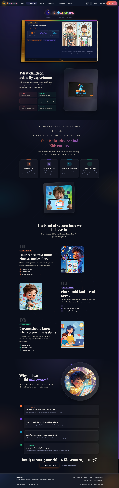</td>
</tr>
<tr>
<td align="center"><sub><b>Arabic — full RTL layout</b></sub></td>
<td align="center"><sub><b>"Why Kidventure" page</b></sub></td>
</tr>
<tr>
<td width="50%">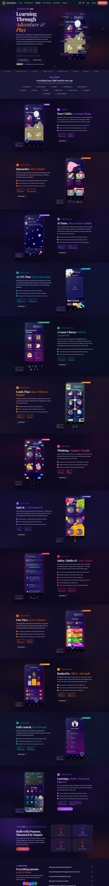</td>
<td width="50%">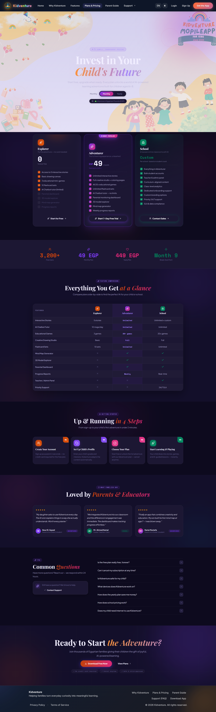</td>
</tr>
<tr>
<td align="center"><sub><b>Features</b></sub></td>
<td align="center"><sub><b>Plans & Pricing</b></sub></td>
</tr>
<tr>
<td width="50%">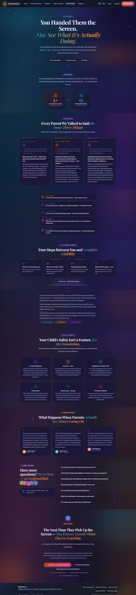</td>
<td width="50%">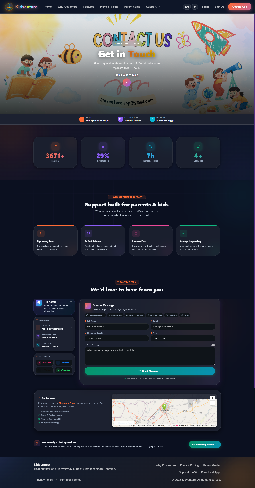</td>
</tr>
<tr>
<td align="center"><sub><b>Parent Guide</b></sub></td>
<td align="center"><sub><b>Contact Us</b></sub></td>
</tr>
</table>

**Authentication**

<table>
<tr>
<td width="50%">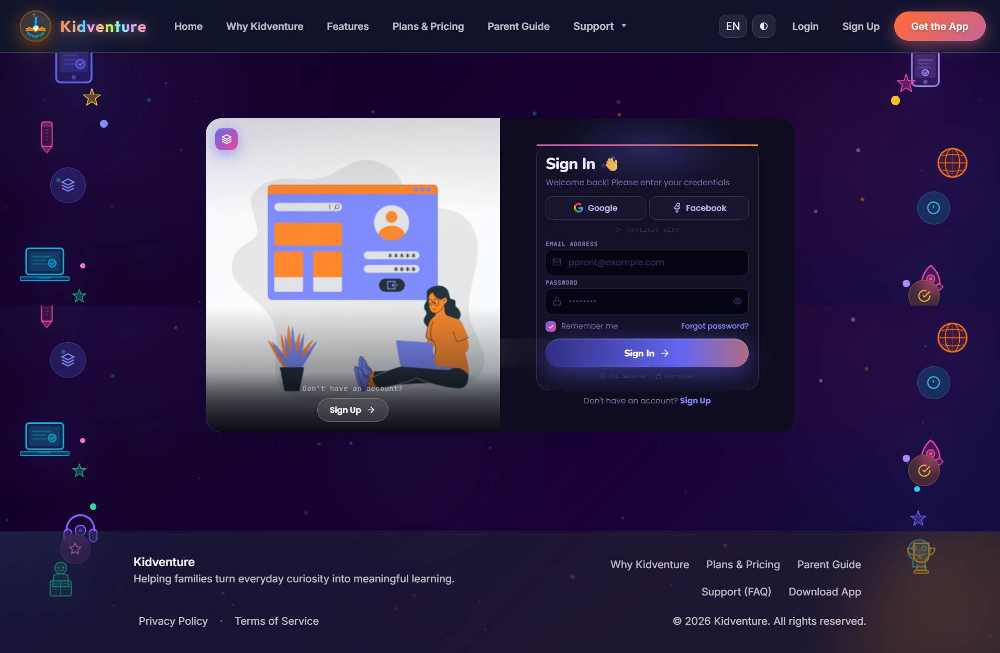</td>
<td width="50%">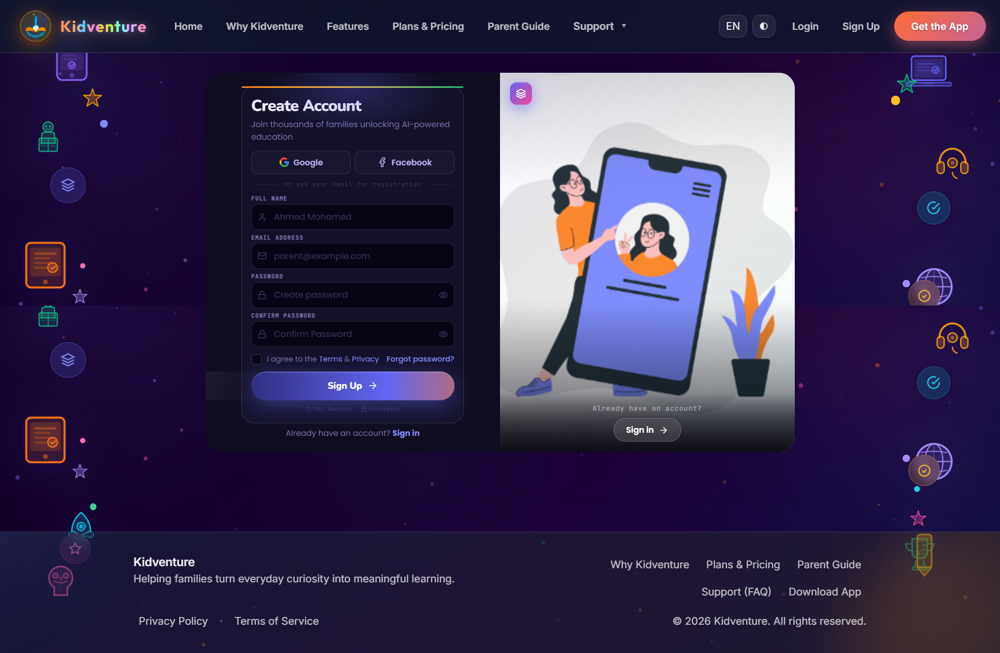</td>
</tr>
<tr>
<td align="center"><sub><b>Sign in (Supabase Auth)</b></sub></td>
<td align="center"><sub><b>Create account (Supabase Auth)</b></sub></td>
</tr>
</table>

**Parent Dashboard** *(UI implemented — connects to live data once the backend is complete, see [Status & Roadmap](#-project-status--roadmap))*

<table>
<tr>
<td width="50%"></td>
<td width="50%">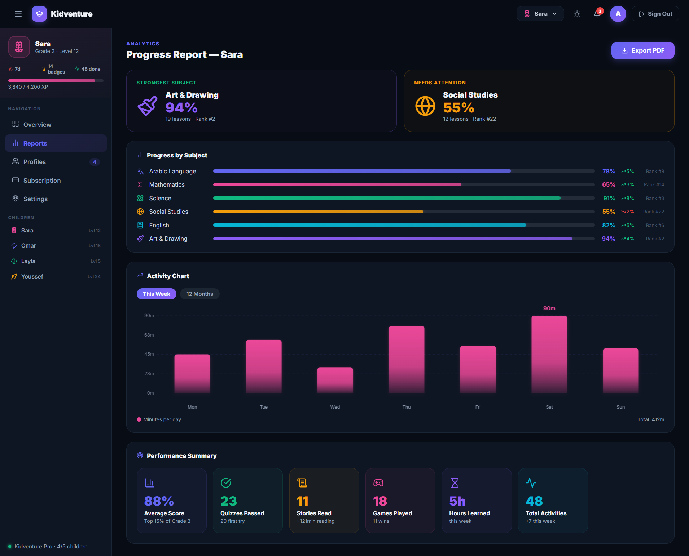</td>
</tr>
<tr>
<td align="center"><sub><b>Overview — streaks, XP, badges, AI insights</b></sub></td>
<td align="center"><sub><b>Reports — progress by subject & activity chart</b></sub></td>
</tr>
<tr>
<td width="50%">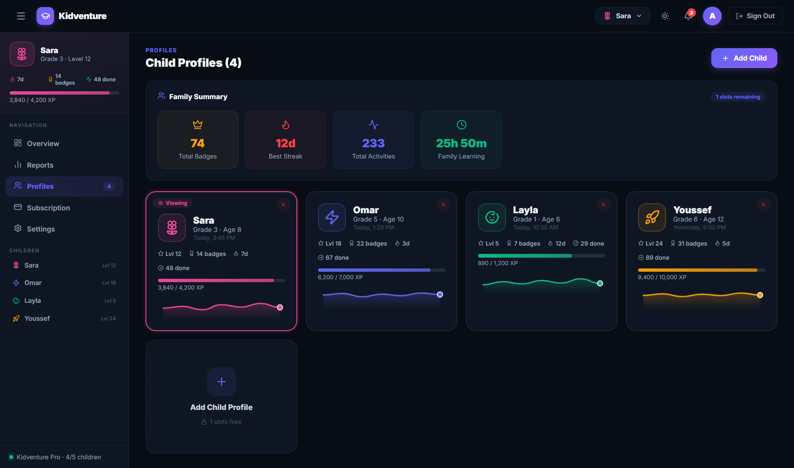</td>
<td width="50%">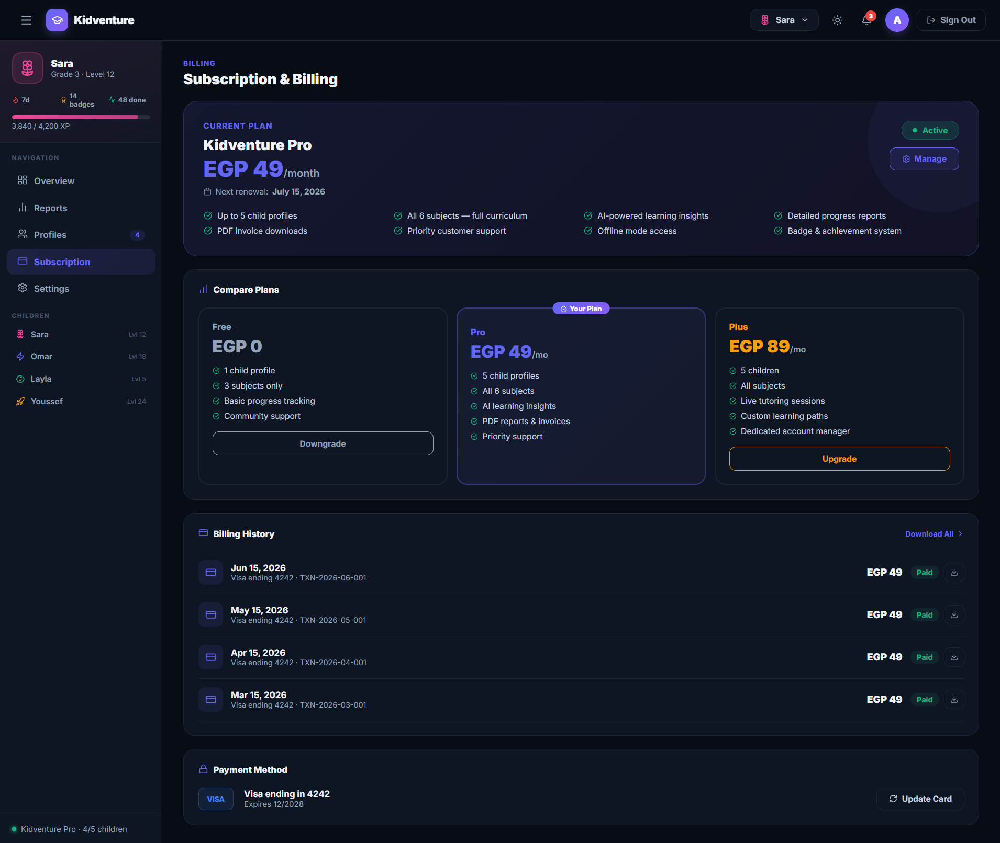</td>
</tr>
<tr>
<td align="center"><sub><b>Multi-child profiles</b></sub></td>
<td align="center"><sub><b>Subscription & billing</b></sub></td>
</tr>
<tr>
<td width="50%">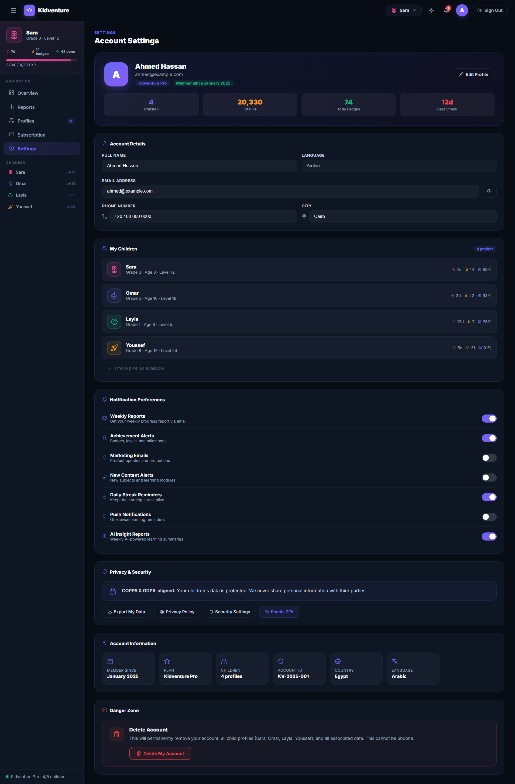</td>
<td width="50%">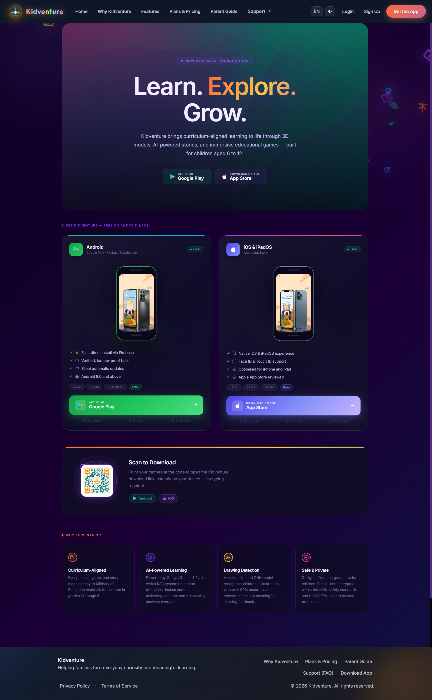</td>
</tr>
<tr>
<td align="center"><sub><b>Account settings & privacy</b></sub></td>
<td align="center"><sub><b>App download page</b></sub></td>
</tr>
</table>

<br />

## ✨ Features

- 🌗 **Full light/dark theming** across every page of the site and dashboard
- 🌍 **Bilingual localization (English & Arabic)** with automatic language detection and a proper **RTL layout** for Arabic — not just mirrored text
- 🔐 **Supabase-powered authentication** — email/password sign up & sign in are fully wired to a live backend
- 📊 **Parent Dashboard** — per-child overview, subject-by-subject progress, streaks, badges, weekly activity charts, and AI-generated insight cards
- 👨‍👩‍👧‍👦 **Multi-child family management** — switch between child profiles, each with independent XP, levels, and stats
- 💳 **Subscription & billing UI** — plan comparison, billing history, and payment method management
- 🖥️ **Rich marketing site** — Home, Why Kidventure, Features, Plans & Pricing, Parent Guide, Support/Help Center, and Contact Us, all fully localized and themed
- 🎨 **Smooth motion design** powered by Framer Motion throughout the site

<br />

## 🧱 Tech Stack

<table>
<tr>
<td valign="top" width="33%">

**Frontend**
- React 19 · Vite 7
- React Router v7
- Framer Motion
- Custom CSS design system
- PostCSS + Autoprefixer
- lucide-react · react-icons

</td>
<td valign="top" width="33%">

**Localization**
- i18next
- react-i18next
- i18next-browser-languagedetector
- Full Arabic RTL support

</td>
<td valign="top" width="33%">

**Backend**
- Supabase (Auth — live)
- Supabase (Database — in progress)
- Postgres

</td>
</tr>
</table>

<br />

## 🚀 Getting Started

### Prerequisites

- Node.js 18+
- npm
- A [Supabase](https://supabase.com/) project (for authentication)

### Installation

```bash
git clone https://github.com/omniaalessawy247-hash/kidventure.git
cd kidventure
npm install
```

### Environment variables

Create a `.env` file in the project root with your Supabase credentials:

```env
VITE_SUPABASE_URL=your_supabase_project_url
VITE_SUPABASE_ANON_KEY=your_supabase_anon_key
```

### Run locally

```bash
npm run dev
```

The app will be available at `http://localhost:5173`.

### Other scripts

| Command | Description |
|:---|:---|
| `npm run build` | Build the app for production |
| `npm run preview` | Preview the production build locally |
| `npm run lint` | Run ESLint |

<br />

## 📁 Project Structure

```
kidventure/
├── docs/
│   └── screenshots/     README assets
├── src/
│   ├── components/      Reusable UI components
│   ├── pages/            Marketing & dashboard pages
│   ├── context/          Theme & language context
│   ├── locales/          i18next translation files (en / ar)
│   ├── lib/               Supabase client & helpers
│   └── ...
├── public/
├── vite.config.js
└── package.json
```

<br />

## 🗺️ Project Status & Roadmap

Kidventure's web platform is under active development as part of a graduation project. Current status:

- ✅ **Marketing site** — fully built, localized (EN/AR), and themed (light/dark)
- ✅ **Authentication** — sign up & login are connected to Supabase and fully functional
- 🚧 **Parent Dashboard** — the UI you see in the screenshots above is complete, but it is currently populated with **mock/example data**. It's a preview of the final experience, built ahead of the backend so the full product vision is clear. It will be wired to live Supabase data (child profiles, activity logs, AI insights, billing) as backend development progresses
- 🚧 **AI insights & reporting** — backend RAG/analytics pipeline in progress

Planned next steps:

- [ ] Connect the dashboard to live Supabase tables (children, activities, subscriptions)
- [ ] Real-time sync with the Flutter mobile app
- [ ] AI-generated weekly parent reports
- [ ] Stripe/payment gateway integration for subscriptions
- [ ] Push notifications for parents

<br />

## 🤝 Contributing

Contributions, issues, and feature requests are welcome. Feel free to check the [issues page](../../issues).

<br />

## 📄 License

This project is part of an academic graduation project. Please add your preferred license (e.g. MIT) here.

<br />

<div align="center">
<sub>Built with React, Vite & Supabase — part of the Kidventure ecosystem</sub>
</div>
